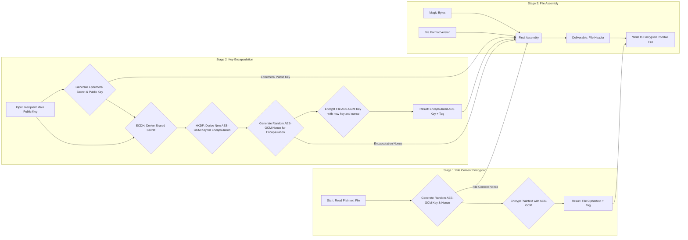
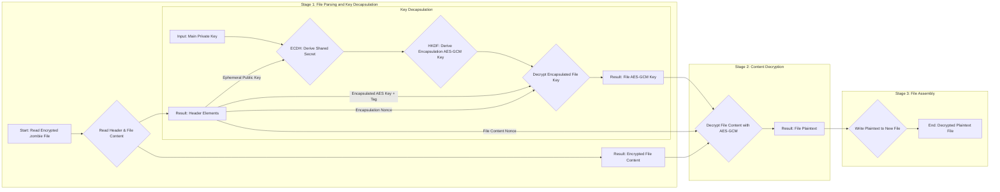

# Cryptography on Cordyceps
Our implementation of the cryptographic functions for **Cordyceps** is designed to strike a balance between a maintainable codebase and standardized, robust security. We've chosen a hybrid approach that uses both symmetric and asymmetric cryptography to protect our data.

At a high level, the process begins with a primary layer of symmetric encryption. We generate a random AES-GCM key and a nonce, which are then used to encrypt the plaintext file content. The [aes_gcm](https://crates.io/crates/aes_gcm) module automatically appends an authentication tag to the resulting ciphertext due to the [Galois/Counter Mode (GCM)](https://en.wikipedia.org/wiki/Galois/Counter_Mode). It achieves this using a block cipher in Counter (CTR) mode, which eliminates the need for padding and makes the output size predictable. This is a crucial step for integrity and authenticity, ensuring the data hasn't been tampered with.

The next challenge is how to securely transmit the symmetric AES key. Simply embedding it in the file would make the entire system vulnerable to anyone who finds it. This is where our second layer of encryption comes in.

To solve this confidentiality problem, we leverage an [Elliptic Curve Integrated Encryption Scheme (ECIES)](https://medium.com/asecuritysite-when-bob-met-alice/elliptic-curve-integrated-encryption-scheme-ecies-encrypting-using-elliptic-curves-dc8d0b87eaa)-like approach. This algorithm works as follows:

1. A [Curve25519](https://en.wikipedia.org/wiki/Curve25519) main public key is provided to our function, which is a static public key belonging to the intended recipient.
2. We generate a new, one-time ephemeral key pair for each encryption operation.
3. Using our ephemeral private key and the recipient's main public key, we perform an [Elliptic Curve Diffie-Hellman (ECDH)](https://en.wikipedia.org/wiki/Elliptic-curve_Diffie%E2%80%93Hellman) key exchange to derive a unique shared secret.
4. This shared secret is then used as input to a Key Derivation Function (KDF). The KDF generates a new, unique AES-GCM key specifically for encrypting our file's symmetric AES key.

This two-step process means that in order to decrypt the file, the recipient must possess the corresponding main private key. With this private key and the ephemeral public key from the file's header, they can re-create the same shared secret. This allows them to decrypt the encapsulated AES key, which is then used to decrypt the main file content.

The final encrypted file is a structured package. Its header contains all the necessary components for secure decryption: the ephemeral public key, the encrypted AES key and its authentication tag, and the nonces used for both the key encapsulation and file content encryption. This modular design ensures that all the information required for decryption is available in one file, while the main private key remains securely offline.

The next sections show graphically how both encryption and decryption processes work.

## Encryption

## Decryption

